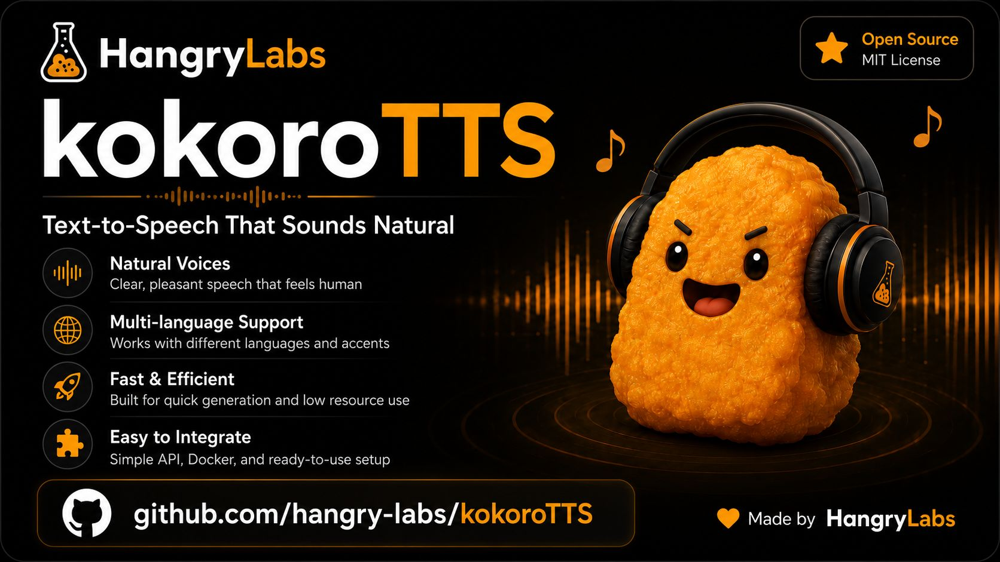

<p align="center">
  <a href="https://nuggies.website/">
    
  </a>
</p>

# Hangry Labs KokoroTTS

Easy-to-run Kokoro text-to-speech Docker images with a browser UI and HTTP API included.

This Hangry Labs fork is made for ease of use. The aim is that anyone should be able to run text to speech without fighting Python environments, missing model files, or unclear setup: a person trying it at home, a developer wiring it into an app, or a professional evaluating it for a production environment. Install Docker, run one command from Quick Start, open the local link, and start generating speech.

You get:
- A browser UI for manual text-to-speech generation
- An HTTP API for your own applications and tools
- No manual Python, model, or audio dependency setup
- 54 Kokoro-82M voices exposed across 9 language prefixes
- WAV, MP3, FLAC, and OGG output
- Offline-friendly usage: download an image once, keep it, and run it later without relying on live model downloads

Official Docker images are published here: [hangrylabs/kokorotts on Docker Hub](https://hub.docker.com/r/hangrylabs/kokorotts/tags).

Voice examples are available here: [hangry-labs.github.io/kokoroTTS/examples](https://hangry-labs.github.io/kokoroTTS/examples/).

Hangry Labs home: [nuggies.website](https://nuggies.website/).

---

## Voice Examples

Preview multilingual product-intro MP3 samples from the full KokoroTTS image:

[Open the voice examples page](https://hangry-labs.github.io/kokoroTTS/examples/)

GitHub does not render embedded audio players directly in README files, so direct MP3 links are also provided below.

| Language | Voice | Sample |
| --- | --- | --- |
| American English | `af_heart` | [Listen to MP3](examples/kokorotts-af_heart.mp3) |
| American English | `af_bella` | [Listen to MP3](examples/kokorotts-af_bella.mp3) |
| American English | `af_nicole` | [Listen to MP3](examples/kokorotts-af_nicole.mp3) |
| American English | `af_aoede` | [Listen to MP3](examples/kokorotts-af_aoede.mp3) |
| American English | `af_kore` | [Listen to MP3](examples/kokorotts-af_kore.mp3) |
| American English | `af_sarah` | [Listen to MP3](examples/kokorotts-af_sarah.mp3) |
| American English | `af_nova` | [Listen to MP3](examples/kokorotts-af_nova.mp3) |
| American English | `af_sky` | [Listen to MP3](examples/kokorotts-af_sky.mp3) |
| American English | `af_alloy` | [Listen to MP3](examples/kokorotts-af_alloy.mp3) |
| American English | `af_jessica` | [Listen to MP3](examples/kokorotts-af_jessica.mp3) |
| American English | `af_river` | [Listen to MP3](examples/kokorotts-af_river.mp3) |
| American English | `am_michael` | [Listen to MP3](examples/kokorotts-am_michael.mp3) |
| American English | `am_fenrir` | [Listen to MP3](examples/kokorotts-am_fenrir.mp3) |
| American English | `am_puck` | [Listen to MP3](examples/kokorotts-am_puck.mp3) |
| American English | `am_echo` | [Listen to MP3](examples/kokorotts-am_echo.mp3) |
| American English | `am_eric` | [Listen to MP3](examples/kokorotts-am_eric.mp3) |
| American English | `am_liam` | [Listen to MP3](examples/kokorotts-am_liam.mp3) |
| American English | `am_onyx` | [Listen to MP3](examples/kokorotts-am_onyx.mp3) |
| American English | `am_santa` | [Listen to MP3](examples/kokorotts-am_santa.mp3) |
| American English | `am_adam` | [Listen to MP3](examples/kokorotts-am_adam.mp3) |
| British English | `bf_emma` | [Listen to MP3](examples/kokorotts-bf_emma.mp3) |
| British English | `bf_isabella` | [Listen to MP3](examples/kokorotts-bf_isabella.mp3) |
| British English | `bf_alice` | [Listen to MP3](examples/kokorotts-bf_alice.mp3) |
| British English | `bf_lily` | [Listen to MP3](examples/kokorotts-bf_lily.mp3) |
| British English | `bm_george` | [Listen to MP3](examples/kokorotts-bm_george.mp3) |
| British English | `bm_fable` | [Listen to MP3](examples/kokorotts-bm_fable.mp3) |
| British English | `bm_lewis` | [Listen to MP3](examples/kokorotts-bm_lewis.mp3) |
| British English | `bm_daniel` | [Listen to MP3](examples/kokorotts-bm_daniel.mp3) |
| Japanese | `jf_alpha` | [Listen to MP3](examples/kokorotts-jf_alpha.mp3) |
| Japanese | `jf_gongitsune` | [Listen to MP3](examples/kokorotts-jf_gongitsune.mp3) |
| Japanese | `jf_nezumi` | [Listen to MP3](examples/kokorotts-jf_nezumi.mp3) |
| Japanese | `jf_tebukuro` | [Listen to MP3](examples/kokorotts-jf_tebukuro.mp3) |
| Japanese | `jm_kumo` | [Listen to MP3](examples/kokorotts-jm_kumo.mp3) |
| Mandarin Chinese | `zf_xiaobei` | [Listen to MP3](examples/kokorotts-zf_xiaobei.mp3) |
| Mandarin Chinese | `zf_xiaoni` | [Listen to MP3](examples/kokorotts-zf_xiaoni.mp3) |
| Mandarin Chinese | `zf_xiaoxiao` | [Listen to MP3](examples/kokorotts-zf_xiaoxiao.mp3) |
| Mandarin Chinese | `zf_xiaoyi` | [Listen to MP3](examples/kokorotts-zf_xiaoyi.mp3) |
| Mandarin Chinese | `zm_yunjian` | [Listen to MP3](examples/kokorotts-zm_yunjian.mp3) |
| Mandarin Chinese | `zm_yunxi` | [Listen to MP3](examples/kokorotts-zm_yunxi.mp3) |
| Mandarin Chinese | `zm_yunxia` | [Listen to MP3](examples/kokorotts-zm_yunxia.mp3) |
| Mandarin Chinese | `zm_yunyang` | [Listen to MP3](examples/kokorotts-zm_yunyang.mp3) |
| Spanish | `ef_dora` | [Listen to MP3](examples/kokorotts-ef_dora.mp3) |
| Spanish | `em_alex` | [Listen to MP3](examples/kokorotts-em_alex.mp3) |
| Spanish | `em_santa` | [Listen to MP3](examples/kokorotts-em_santa.mp3) |
| French | `ff_siwis` | [Listen to MP3](examples/kokorotts-ff_siwis.mp3) |
| Hindi | `hf_alpha` | [Listen to MP3](examples/kokorotts-hf_alpha.mp3) |
| Hindi | `hf_beta` | [Listen to MP3](examples/kokorotts-hf_beta.mp3) |
| Hindi | `hm_omega` | [Listen to MP3](examples/kokorotts-hm_omega.mp3) |
| Hindi | `hm_psi` | [Listen to MP3](examples/kokorotts-hm_psi.mp3) |
| Italian | `if_sara` | [Listen to MP3](examples/kokorotts-if_sara.mp3) |
| Italian | `im_nicola` | [Listen to MP3](examples/kokorotts-im_nicola.mp3) |
| Brazilian Portuguese | `pf_dora` | [Listen to MP3](examples/kokorotts-pf_dora.mp3) |
| Brazilian Portuguese | `pm_alex` | [Listen to MP3](examples/kokorotts-pm_alex.mp3) |
| Brazilian Portuguese | `pm_santa` | [Listen to MP3](examples/kokorotts-pm_santa.mp3) |

---

## Quick Start

```bash
docker run -p 7860:7860 --gpus all hangrylabs/kokorotts:v0.2
```

Run on CPU:

```bash
docker run -p 7860:7860 hangrylabs/kokorotts:v0.2
```

Run on a specific GPU (example: GPU index `1`):

```bash
docker run -p 7860:7860 --gpus "device=1" -e CUDA_VISIBLE_DEVICES=1 hangrylabs/kokorotts:v0.2
```

Then open: **[http://localhost:7860](http://localhost:7860)**

---

## API Usage Example

```bash
curl -X POST "http://localhost:7860/tts/generate" \
  -H "Content-Type: application/json" \
  -d '{"text":"Hello world!","voice":"af_heart"}' \
  -o output.wav
```

The modern synthesis endpoint is `POST /tts/generate`; `POST /tts/convert` remains available for older clients.
When `output_format` is omitted, the API returns WAV audio as before.
The web UI defaults to MP3 downloads because it is a more practical size for interactive use.
To request a smaller response, add `output_format` with one of `mp3`, `flac`, or `ogg`:

```bash
curl -X POST "http://localhost:7860/tts/generate" \
  -H "Content-Type: application/json" \
  -d '{"text":"Hello world!","voice":"af_heart","output_format":"mp3"}' \
  -o output.mp3
```

Optional audio controls are available on `/tts/generate`, `/tts/convert`, and `/tts/stream`.
They are neutral by default, so existing API clients do not pay the extra ffmpeg processing cost unless a control is changed:

```bash
curl -X POST "http://localhost:7860/tts/generate" \
  -H "Content-Type: application/json" \
  -d '{"text":"Hello world!","voice":"af_heart","output_format":"mp3","pitch_semitones":2,"tempo":1.1,"volume":0.9,"normalize":true}' \
  -o output.mp3
```

Useful discovery endpoints:

- `GET /tts/status`
- `GET /tts/defaults`
- `GET /tts/formats`
- `GET /tts/stream-formats`
- `GET /tts/languages`
- `GET /tts/speakers?language=a`
- `GET /tts/voices`
- `POST /tts/metrics`
- `POST /tts/stream`
- `POST /tts/purge`

---

## About This Fork

This project is an independently maintained fork of the original [Kokoro](https://github.com/hexgrad/kokoro) by [hexgrad](https://github.com/hexgrad).
The original work is licensed under the Apache License 2.0, and we thank the authors for their excellent research and contributions.

While Kokoro is an impressive model/library project, this Hangry Labs fork focuses on making it simple to run and integrate: Docker image, included UI, API support, offline-friendly assets, and practical examples out of the box.

License and attribution are preserved in [`LICENSE`](LICENSE).

## Support & Issues

If you encounter bugs, have feature requests, or need help using Hangry Labs KokoroTTS:
- Please open a new [GitHub Issue](https://github.com/Hangry-Labs/kokoroTTS/issues) with as much detail as possible
- Include error messages, logs, and reproduction steps if applicable
- For general questions or ideas, use the project repository discussions when available

---

## Docker Features

- Prefetched Kokoro model, config, voice assets, and Japanese UniDic data
- GPU acceleration when available
- HTTP API + web UI in one container
- Offline-friendly runtime flags
- Full Kokoro-82M voice set exposed in the UI/API

---

## Docker Hub

You can explore all available Hangry Labs KokoroTTS container images on [Docker Hub](https://hub.docker.com/r/hangrylabs/kokorotts/tags).

This is useful if you want to:
- Select a specific version of KokoroTTS for compatibility
- Check the latest available builds before pulling
- Verify image tags for deployment

Current tag pattern:
- Full image: `v0.2`, future versions as `vX.Y`

---

## Local Development

```bash
task image
task imagerun
task imageweb
task imageapi
```

Hot-swap local app code into the container without rebuilding:

```bash
task localrun
task logs
```

Release from a clean tree:

```bash
task release DRY_RUN=1
task release
```

---

## Version History

### v0.3 Snapshot

- Added optional UI/API audio controls for pitch, tempo, volume, and loudness normalization with neutral defaults for backward compatibility.
- Updated Docker publish workflow support for `vX.Y` tags, explicit `hangrylabs/kokorotts` publishing, and manual release dispatch with a selected checkout ref.
- Removed unnecessary caution callouts from public docs and the Stream tab for a cleaner product-facing experience.

### v0.2

- Moved public project direction under Hangry Labs.
- Added a root `VERSION` file for the app/runtime release label.
- Kept Python package metadata on a PEP 440-compatible development version for reliable builds.
- Exposed the full Kokoro-82M voice set in the UI/API.
- Added optional `wav`, `mp3`, `flac`, and `ogg` output formats in the UI/API while keeping WAV as the default.
- Added language-aware UI sample texts with 10 lighthearted prompts per served language prefix.
- Added a Hangry Labs examples page with generated MP3 product-intro samples, native-language page selection, and language filtering.
- Added pinned dependency workflow with `requirements.in`, resolved `requirements.txt`, and `task deps`.
- Removed old Gatsby/Frankenstein long-text demo buttons and unused bundled text files.
- Added multilingual Docker prefetch support, including UniDic for offline Japanese synthesis.
- Added `task imageapi-voice` and `task imageapi-format` for practical smoke tests.

Run with:

```bash
docker run -p 7860:7860 --gpus all hangrylabs/kokorotts:v0.2
docker run -p 7860:7860 --gpus "device=1" -e CUDA_VISIBLE_DEVICES=1 hangrylabs/kokorotts:v0.2
```

### v0.0.1

- Initial release of the KokoroTTS Docker image.
- Trimmed the image to keep it practical for deployment.
- Baked required models and assets into the image for offline use.
- Added startup/runtime details showing which specific GPU is detected.
- Introduced Dockerized WebUI + API setup for easy local or server deployment.
- Added integration-friendly API support for compatibility with the MeloTTS image.
- Enabled automated build and deployment workflow.

---

## License

This fork is licensed under the [Apache License 2.0](LICENSE).

Original work by [hexgrad](https://github.com/hexgrad) in [Kokoro](https://github.com/hexgrad/kokoro).
