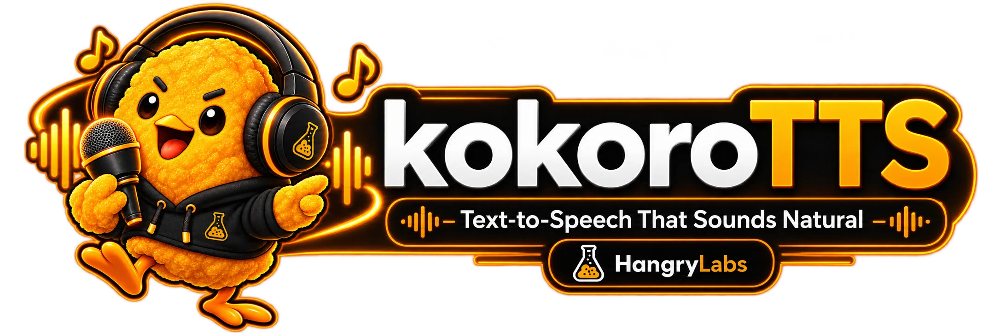
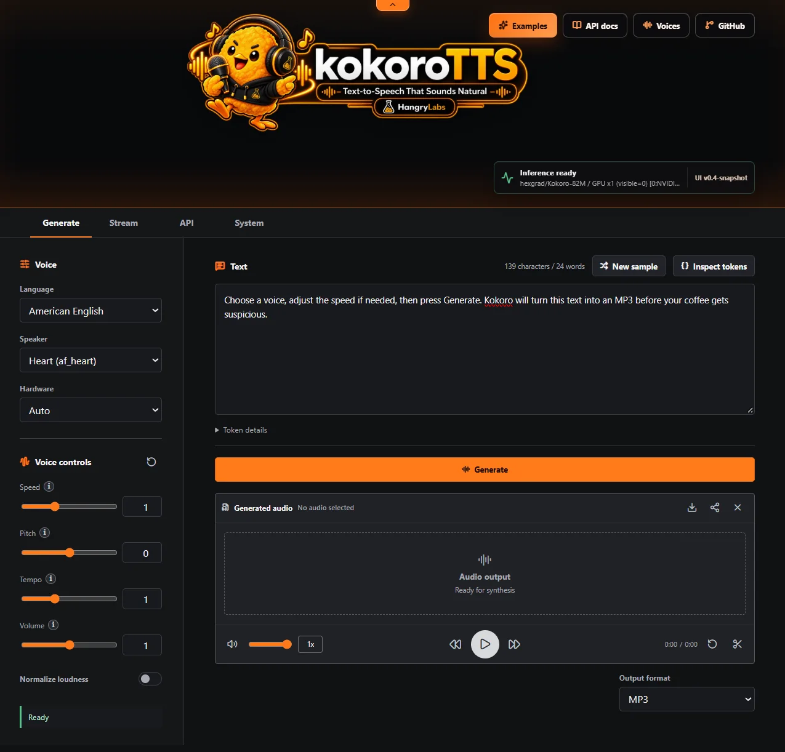

<p align="center">
  <a href="https://github.com/Hangry-Labs/kokoroTTS">
    
  </a>
</p>

<p align="center">
  <strong>English</strong> ·
  <a href="README.nb.md">Norsk bokmål</a> ·
  <a href="README.pl.md">Polski</a> ·
  <a href="README.ja.md">日本語</a> ·
  <a href="README.zh.md">简体中文</a> ·
  <a href="README.es.md">Español</a>
</p>

# Hangry Labs KokoroTTS

Easy-to-run Kokoro text-to-speech Docker images with a browser UI and HTTP API included.

This Hangry Labs fork is made for ease of use. The aim is that anyone should be able to run text to speech without fighting Python environments, missing model files, or unclear setup: a person trying it at home, a developer wiring it into an app, or a professional evaluating it for a production environment. Install Docker, run one command from Quick Start, open the local link, and start generating speech.

You get:
- A responsive browser audio workspace for generation, streaming, playback, and downloads
- OpenAI-compatible and KokoroTTS-native HTTP APIs for applications and tools
- Experimental multi-character and multilingual dialogue scripting through SSML
- No manual Python, model, or audio dependency setup
- 173 voices across 11 supported languages, including dedicated German, Vietnamese, and enhanced Chinese checkpoints
- WAV, MP3, FLAC, OGG Vorbis, Opus, AAC, and raw PCM output
- Offline-friendly usage: download an image once, keep it, and run it later without relying on live model downloads

Official container images are published to both [Docker Hub](https://hub.docker.com/r/hangrylabs/kokorotts/tags) and [GitHub Container Registry](https://github.com/Hangry-Labs/kokoroTTS/pkgs/container/kokorotts).

Examples and voice previews: [hangry-labs.github.io/kokoroTTS/examples](https://hangry-labs.github.io/kokoroTTS/examples/). Dialogue and mixed-language SSML examples: [SSML examples](https://hangry-labs.github.io/kokoroTTS/examples/ssml.html).

Hangry Labs home: [hangrylabs.app](https://hangrylabs.app/).

## Contents

- [Listen and Have a Look](#listen-and-have-a-look)
- [Quick Start](#quick-start)
- [API Usage](#api-usage)
  - [OpenAI-Compatible API](#openai-compatible-api)
  - [KokoroTTS Native API](#kokorotts-native-api)
  - [Experimental SSML Input](#experimental-ssml-input)
  - [Native Python Client](#native-python-client)
- [About This Fork](#about-this-fork)
- [Support & Issues](#support--issues)
- [Docker Images](#docker-images)
- [Local Development](#local-development)
- [Performance Benchmarks](#performance-benchmarks)
- [Version History](#version-history)
- [License](#license)

---

## Listen and Have a Look

Hear all 173 voices in their supported languages on the interactive examples page. Choose a language, compare speakers, and listen directly in the browser:

**[Open the KokoroTTS examples page](https://hangry-labs.github.io/kokoroTTS/examples/)**

To hear multiple characters generated in one request and see the exact scripts, open the dedicated **[SSML dialogue examples](https://hangry-labs.github.io/kokoroTTS/examples/ssml.html)**.

The included interface provides generation and streaming workflows, precise voice controls, waveform playback and downloads, live API information, and runtime/GPU monitoring.

<p align="center">
  <a href="https://hangry-labs.github.io/kokoroTTS/examples/">
    
  </a>
</p>

---

## Quick Start

### Stable Release

Use the versioned `v0.3` image for a repeatable installation. Released images are pinned by both tag and registry digest so Docker verifies the exact published image:

```bash
docker run -p 7860:7860 --gpus all hangrylabs/kokorotts:v0.3@sha256:2a9223d55273757e04b1c29c80b4d1f4a69539a8f52070813d8d05a399e99a6f
```

Run on CPU:

```bash
docker run -p 7860:7860 hangrylabs/kokorotts:v0.3@sha256:2a9223d55273757e04b1c29c80b4d1f4a69539a8f52070813d8d05a399e99a6f
```

Run on a specific GPU (example: GPU index `1`):

```bash
docker run -p 7860:7860 --gpus "device=1" -e CUDA_VISIBLE_DEVICES=1 hangrylabs/kokorotts:v0.3@sha256:2a9223d55273757e04b1c29c80b4d1f4a69539a8f52070813d8d05a399e99a6f
```

### Current Snapshot

Use `latest` to try the current `v1.0` snapshot from the main development line. This moving tag can change between releases. Choose one command below.

Run the full image with NVIDIA GPU support and persistent models and settings:

```bash
docker run -p 7860:7860 --gpus all -v kokorotts_data:/app/persistent hangrylabs/kokorotts:latest
```

The same image is also available from GitHub Container Registry:

```bash
docker run -p 7860:7860 --gpus all -v kokorotts_data:/app/persistent ghcr.io/hangry-labs/kokorotts:latest
```

Run the full image on CPU with persistent models and settings:

```bash
docker run -p 7860:7860 -v kokorotts_data:/app/persistent hangrylabs/kokorotts:latest
```

Run the smaller tiny image with NVIDIA GPU support. It downloads model assets when first needed:

```bash
docker run -p 7860:7860 --gpus all -v kokorotts_data:/app/persistent hangrylabs/kokorotts:latest_tiny
```

The volume is optional. Remove `-v kokorotts_data:/app/persistent` to keep models and settings only inside that container; KokoroTTS still starts and works normally, but those files are lost when the container is removed.

Then open: **[http://localhost:7860](http://localhost:7860)**

---

## API Usage

Interactive OpenAPI documentation for both API families is available at **[http://localhost:7860/tts/docs](http://localhost:7860/tts/docs)**.

### OpenAI-Compatible API

Use this API when an application or SDK already supports OpenAI text to speech. The compatibility endpoint follows the OpenAI request shape and defaults to MP3:

```bash
curl -X POST "http://localhost:7860/v1/audio/speech" \
  -H "Content-Type: application/json" \
  -d '{"model":"kokoro","input":"Hello from KokoroTTS.","voice":"af_heart"}' \
  -o output.mp3
```

The official OpenAI Python client works by changing only its base URL and using any non-empty local key:

```python
from openai import OpenAI

client = OpenAI(base_url="http://localhost:7860/v1", api_key="local")

audio = client.audio.speech.create(
    model="kokoro",
    input="Hello from my Python app.",
    voice="af_heart",
    response_format="mp3",
)
audio.write_to_file("hello.mp3")
```

The canonical model id is `kokoro`; `kokoro-82m`, `kokorotts`, and `hexgrad/Kokoro-82M` are accepted aliases. Use Kokoro voice ids from `GET /tts/voices`. Exact-name aliases are also available for `alloy`, `echo`, `fable`, `nova`, and `onyx`. Supported OpenAI response formats are `mp3`, `opus`, `aac`, `flac`, `wav`, and raw 24 kHz signed 16-bit little-endian `pcm`. Speed accepts the OpenAI range from `0.25` to `4.0`.

Kokoro does not support natural-language `instructions` or OpenAI SSE speech events. Non-empty `instructions` and `stream_format: "sse"` return explicit OpenAI-shaped errors instead of being ignored.

OpenAI-compatible endpoints:

- `GET /v1/models`
- `GET /v1/models/{model}`
- `POST /v1/audio/speech`
- `GET /health`
- `GET /health/live`
- `GET /health/ready`

Authentication is disabled by default for simple local use. Set `KOKOROTTS_API_KEY` to require `Authorization: Bearer <key>` on `/v1/*` routes:

```bash
docker run -p 7860:7860 --gpus all \
  -e KOKOROTTS_API_KEY="replace-with-a-secret" \
  -v kokorotts_data:/app/persistent \
  hangrylabs/kokorotts:latest
```

Health routes remain public for Docker and orchestration probes.

### KokoroTTS Native API

Use the native API for the complete Kokoro feature set: device selection, true pipeline-segment streaming, pitch, tempo, volume, normalization, discovery, phoneme inspection, and model lifecycle controls. Its existing defaults remain backward compatible.

```bash
curl -X POST "http://localhost:7860/tts/generate" \
  -H "Content-Type: application/json" \
  -d '{"text":"Hello world!","voice":"af_heart"}' \
  -o output.wav
```

The modern synthesis endpoint is `POST /tts/generate`; `POST /tts/convert` remains available for older clients.
When `output_format` is omitted, the API returns WAV audio as before.
The web UI defaults to MP3 downloads because it is a more practical size for interactive use.
Native output formats are `wav`, `mp3`, `flac`, `ogg`, `opus`, `aac`, and `pcm`. To request a smaller response, set `output_format` to `mp3`:

```bash
curl -X POST "http://localhost:7860/tts/generate" \
  -H "Content-Type: application/json" \
  -d '{"text":"Hello world!","voice":"af_heart","output_format":"mp3"}' \
  -o output.mp3
```

Optional audio controls are available on `/tts/generate`, `/tts/convert`, and `/tts/stream`.
They are neutral by default, so existing API clients do not pay the extra ffmpeg processing cost unless a control is changed:

```bash
curl -X POST "http://localhost:7860/tts/generate" \
  -H "Content-Type: application/json" \
  -d '{"text":"Hello world!","voice":"af_heart","output_format":"mp3","pitch_semitones":2,"tempo":1.1,"volume":0.9,"normalize":true}' \
  -o output.mp3
```

#### Experimental SSML Input

The native generation, streaming, metrics, and token-inspection endpoints accept experimental SSML when `input_type` is explicitly set to `ssml`. The default remains `text`; markup is never detected or enabled automatically. The browser UI exposes the same opt-in mode with an experimental indicator and an in-app rules guide.

```bash
curl -X POST "http://localhost:7860/tts/generate" \
  -H "Content-Type: application/json" \
  -d '{"input_type":"ssml","text":"<speak><voice name=\"af_heart\">Good morning, Michael.</voice><break time=\"250ms\"/><voice name=\"am_michael\">Good morning. Coffee first?</voice></speak>","voice":"af_heart","output_format":"mp3"}' \
  -o dialogue.mp3
```

Supported elements:

- `<voice name="af_heart">...</voice>`: select an enabled voice for a dialogue turn. The selected voice also selects its native language unless a containing or nested `<lang>` is explicit.
- `<lang xml:lang="en-US">...</lang>`: use a different language frontend while preserving the current voice. This retains character identity, but a voice that was not trained for that language can retain a strong accent or pronounce unsupported sounds poorly.
- `<prosody speed="0.9" pitch="+2st" tempo="1.05" volume="0.9">...</prosody>`: style one segment. Every attribute is optional; omitted or blank values inherit unchanged. Speed and tempo accept `0.5-2`, pitch accepts `-12st` to `+12st`, and volume accepts `0-2`.
- `<break time="500ms"/>`: set the complete pause at that boundary, up to 10 seconds per break and 30 seconds per request. Use `0ms` for an immediate handoff.
- `<sub alias="spoken text">label</sub>`: speak the alias.
- `<say-as interpret-as="characters|number|ordinal">...</say-as>`: spell characters, read a number, or read an English ordinal. Ordinals are currently limited to English voices.
- `<phoneme alphabet="ipa" ph="...">label</phoneme>`: bypass G2P with Kokoro/eSpeak-compatible IPA.

`<voice>`, `<lang>`, and `<prosody>` can contain the other supported elements, up to eight nesting levels. Nested prosody multiplies speed, tempo, and volume while adding pitch; the effective values, including request-level controls, must remain inside the documented ranges. Speed controls model delivery. Pitch, tempo, and volume are optional post-effects and neutral values skip that work. Complete-file loudness normalization remains request-wide. Kokoro's model-generated padding is removed only at internal SSML boundaries: adjacent speech units receive a short 100 ms handoff by default, while an explicit `<break>` replaces that default with its requested duration. The beginning and end of the complete recording remain untouched. Voice switching provides reliable multilingual dialogue by selecting an appropriate voice for each segment; `<lang>` alone changes pronunciation processing but cannot turn a monolingual checkpoint into a bilingual model. Voice names must be enabled in the deployment. Common BCP-47 forms such as `en-US`, `en-GB`, `zh-CN`, `ja-JP`, `de-DE`, and `vi-VN` are accepted.

One `<speak>` root is required. Documents are limited to 50,000 characters and 256 elements; direct phoneme values are limited to 510 characters and experimental ordinals to 18 digits. Unsupported markup, malformed or unsafe XML, and inputs above these limits return HTTP 400. SSML is currently a native KokoroTTS feature; the OpenAI-compatible endpoint continues to treat `input` as plain text.

Native and system endpoints:

- `POST /tts/generate`
- `POST /tts/stream`
- `POST /tts/convert` (backward-compatible alias)
- `GET /tts/status`
- `GET /tts/defaults`
- `GET /tts/formats`
- `GET /tts/stream-formats`
- `GET /tts/languages`
- `GET /tts/samples?language=a`
- `GET /tts/speakers?language=a`
- `GET /tts/voices`
- `GET /system/settings`
- `PUT /system/settings/model-families`
- `PUT /system/settings/voices` (compatibility endpoint; selected voices expand to complete model families)
- `POST /system/models/purge`
- `POST /tts/metrics`
- `POST /tts/tokenize`
- `POST /tts/purge` (backward-compatible alias)

#### Native Python Client

Install the stable HTTP client directly from the Git tag without the local inference dependencies:

```bash
pip install --no-deps "kokorotts @ git+https://github.com/Hangry-Labs/kokoroTTS.git@v0.3"
```

Then point it at a running KokoroTTS server:

```python
from kokorotts import KokoroTTSClient

tts = KokoroTTSClient("http://localhost:7860")

audio = tts.generate(
    text="Hello from my Python app.",
    voice="af_heart",
    output_format="mp3",
    pitch_semitones=2,
)

audio.save("hello.mp3")
```

---

## About This Fork

This project is an independently maintained fork of the original [Kokoro](https://github.com/hexgrad/kokoro) by [hexgrad](https://github.com/hexgrad).
The original work is licensed under the Apache License 2.0, and we thank the authors for their excellent research and contributions.

While Kokoro is an impressive model/library project, this Hangry Labs fork focuses on making it simple to run and integrate: Docker image, included UI, API support, offline-friendly assets, and practical examples out of the box.

German synthesis uses the Apache-2.0 Kokoro-compatible [Kikiri German Martin](https://huggingface.co/kikiri-tts/kikiri-german-martin) and [Kikiri German Victoria](https://huggingface.co/kikiri-tts/kikiri-german-victoria) model/voice releases. Each voice uses its matching fine-tuned checkpoint.

Vietnamese synthesis uses the Apache-2.0 [ContextBoxAI Kokoro Vietnamese](https://huggingface.co/contextboxai/Kokoro-Vietnamese) checkpoint and fourteen voice packs from [Kokoro-Vietnamese](https://github.com/iamdinhthuan/Kokoro-Vietnamese). All Vietnamese voices share one fine-tuned checkpoint and use `vig2p` for Vietnamese text normalization and phonemization.

Enhanced Mandarin and mixed Chinese-English synthesis uses the Apache-2.0 [Kokoro-82M-v1.1-zh](https://huggingface.co/hexgrad/Kokoro-82M-v1.1-zh) checkpoint with 100 numbered Chinese voices plus the English Maple, Sol, and Vale voices. It is an additional selectable model family and does not replace the standard Kokoro v1.0 voices.

License and attribution are preserved in [`LICENSE`](LICENSE) and
[`THIRD_PARTY_NOTICES.md`](THIRD_PARTY_NOTICES.md).

## Support & Issues

If you encounter bugs, have feature requests, or need help using Hangry Labs KokoroTTS:
- Please open a new [GitHub Issue](https://github.com/Hangry-Labs/kokoroTTS/issues) with as much detail as possible
- Include error messages, logs, and reproduction steps if applicable
- For general questions or ideas, use the project repository discussions when available

---

## Docker Images

All published tags are mirrored on [Docker Hub](https://hub.docker.com/r/hangrylabs/kokorotts/tags) and [GitHub Container Registry](https://github.com/Hangry-Labs/kokoroTTS/pkgs/container/kokorotts). Replace `hangrylabs/kokorotts` in any command below with `ghcr.io/hangry-labs/kokorotts` to use GHCR.

- Full images contain the standard Kokoro model, both dedicated German checkpoints, the dedicated Vietnamese checkpoint, the enhanced Chinese v1.1 checkpoint, all 173 voice packs, configuration, and required language data. They are ready for offline use after the image has been pulled.
- Tiny images contain the complete runtime but download Hugging Face model and voice assets on first use. Mount the optional `/app/persistent` data volume to preserve downloads and settings across containers.
- Versioned tags such as `v0.3` and `v0.3_tiny` are fixed releases suitable for repeatable deployments.
- Moving tags `latest` and `latest_tiny` follow the current `v1.0` snapshot built from `main`.

Exact commands for every release and the current snapshot are kept in [Version History](#version-history).

---

## Local Development

```bash
task image
task image-tiny
task imagerun
task imagerun-tiny
task imageweb
task imageapi
task ssml-test
task unit-test
task ui-test
task client-test
task openai-client-test
```

The default image is the full baked image and keeps model, voice, and required language assets inside the container for offline use. The tiny image keeps required runtime/language dependencies but skips baked Hugging Face model/voice assets; run it online once to download the voices you use. Both images work without a mounted volume.

Hot-swap local app code into the container without rebuilding:

```bash
task localrun
task localrun-tiny
task logs
task client-test
```

`task imagerun` and `task localrun` mount the named `kokorotts_data` volume at `/app/persistent`. It stores downloaded Hugging Face assets under `models/huggingface` and operator settings under `app`, so both survive container and image replacement. Baked run tasks seed missing model files from the full image before startup, preserving offline behavior even if the volume was first created by a tiny run. Direct Docker runs may omit the volume and use the same paths inside the disposable container. Use `task nuke` when you need a true from-scratch data test.

The deployment controls in the System tab operate on five independently loaded model packs: the shared standard Kokoro checkpoint, German Martin, German Victoria, Kokoro Vietnamese, and Kokoro v1.1 Chinese. All packs are enabled by default on fresh installations. Existing installations that had all four former packs enabled automatically gain the new Chinese pack, while customized selections remain unchanged. The 54 standard voices, 14 Vietnamese voices, and 103 v1.1 Chinese/English voices move as their respective groups because each group shares one model and therefore has the same VRAM cost. Model weights load only when one of their voices is first used; disabling a pack releases cached models after active generations finish. In the tiny image, a disabled custom model is not downloaded unless its pack is later enabled and called.

Release from a clean tree:

```bash
task release DRY_RUN=1
task release
```

When the release candidate has already completed full validation and should not be rebuilt locally:

```bash
task release DRY_RUN=1 SKIP_VALIDATION=1
task release SKIP_VALIDATION=1
```

The release task creates the release commit, annotated `vX.Y` Git tag, and next-snapshot commit locally; it does not push them. Push the two refs printed by the task when the release is ready. Pushing `main` publishes the moving `latest` and `latest_tiny` images to Docker Hub and GHCR. Pushing the release tag publishes immutable `vX.Y` and `vX.Y_tiny` images from the tagged release commit. A GitHub Release page entry is separate from the Git tag and can be created from that existing tag without rebuilding the images.

---

## Performance Benchmarks

### Voice Generation

Run the small, non-recording smoke benchmark against an active local server:

```bash
task benchmark-smoke
```

Run five measured generations for every voice in `examples/voices.js` and append a comparable result to the benchmark history:

```bash
task benchmark-tts BENCHMARK_COMMENT="describe this configuration"
```

Before measurement, the benchmark generates one voice per language so every language path and its required weights are warm. It then exercises full WAV generation through the public HTTP API and reports overall, per-language, and per-voice latency, audio duration, realtime factor, and realtime speed. See [`benchmarks/tts`](benchmarks/tts/) for the methodology, current results, and comparison guidance.

The current `v1.0-snapshot` RTX 5070 Ti result covers all 70 voices and 11 languages with five measured generations per voice. All 350 requests passed with a 1.369-second mean, 2.308-second P95, and 15.60x realtime speed. This run shared the GPU with a resident idle Qwen container, so it is a conservative development validation rather than a quiet-GPU record.

### VRAM Usage

VRAM measurement is a separate isolated-container benchmark because it requires a quiet GPU and direct access to the Kokoro process's PyTorch allocator. Stop the local server and other avoidable GPU workloads before recording an official result:

```bash
task imagestop
task benchmark-vram VRAM_BENCHMARK_COMMENT="clean GPU baseline"
```

The report separates process-specific allocated/reserved VRAM from whole-device usage, and records lifecycle, per-language, and per-voice peaks. Use `task benchmark-vram-smoke` for a one-voice implementation check that does not update history. See [`benchmarks/vram`](benchmarks/vram/) for the full methodology and reports.

Before the development line was promoted to `v1.0-snapshot`, its official VRAM baseline was recorded under the `v0.4-snapshot` label on a quiet NVIDIA GeForce RTX 5070 Ti across all 70 voices and 11 languages, with no failed generation. The initial standard Kokoro model used 317.6 MiB allocated and 332.0 MiB reserved before inference; the German and Vietnamese checkpoints then loaded lazily as their voices were reached. The sequential single-request run peaked at 1725.1 MiB allocated and 2052.0 MiB reserved by the Kokoro process. Whole-device usage rose from the benchmark's 1293.6 MiB idle reference to 3413.6 MiB; this includes the Windows display stack and other non-Kokoro GPU allocations. Vietnamese was the heaviest model family, with `storyvert` setting the overall process peak. The complete lifecycle, language, and voice measurements are in [`VRAM_BENCHMARKS.md`](benchmarks/vram/VRAM_BENCHMARKS.md) and [`DETAILS.md`](benchmarks/vram/DETAILS.md).

---

## Version History

### v1.0 Snapshot

#### Docker

The current development snapshot is published through the moving `latest` and `latest_tiny` tags. Each block below is one complete alternative.

Full image with NVIDIA GPU support:

```bash
docker run -p 7860:7860 --gpus all -v kokorotts_data:/app/persistent hangrylabs/kokorotts:latest
```

Full image on CPU:

```bash
docker run -p 7860:7860 -v kokorotts_data:/app/persistent hangrylabs/kokorotts:latest
```

Full image on GPU index `1`:

```bash
docker run -p 7860:7860 --gpus "device=1" -e CUDA_VISIBLE_DEVICES=1 -v kokorotts_data:/app/persistent hangrylabs/kokorotts:latest
```

Tiny image with NVIDIA GPU support:

```bash
docker run -p 7860:7860 --gpus all -v kokorotts_data:/app/persistent hangrylabs/kokorotts:latest_tiny
```

The data volume is recommended but optional. Without it, the same files are stored in the container and disappear when that container is removed.

#### Included Changes

- Added a self-contained Docker compliance bundle with complete copyleft
  notices, checksum-verified corresponding source for the bundled eSpeak NG,
  phonemizer, loader, and number-normalization components, exact Debian source
  provenance, retained build inputs, and an offline `task compliance-test`
  verifier shared by full and tiny images.
- Added immutable UTC image-build timestamps and Git revisions to snapshot runtime badges and native status metadata, making moving `latest` reports identifiable from a screenshot while stable releases keep their concise version label.
- Added complete English, Polish, Japanese, Simplified Chinese, Spanish, and German localization to the browser workspace, including dynamic generation, streaming, model settings, audio-editor, and GPU-monitor states. Locale routes and the selected language persist across reloads.
- Added concise Norwegian, Polish, Japanese, Simplified Chinese, and Spanish README entry points that lead to the corresponding Hangry Labs product guides, and connected the public examples page to locale-aware application links.
- Replaced Gradio with a responsive standalone audio workspace based on the tested Hangry Labs Qwen3-ASR-STT interface.
- Replaced the animated product text and oversized Hangry Labs banner with a viewport-bounded KokoroTTS brand hero, added a compact-mode Hangry Labs badge and mascot browser icon, and introduced an animated persistent compact header that restores before first paint.
- Restored loaded-model details in the inference status, linked the displayed UI version to GitHub Releases, consolidated UI, examples, and GitHub Pages artwork under `assets/`, and refreshed the documentation screenshot as an optimized WebP.
- Added dedicated Generate, Stream, API, and System views with live runtime status, language and voice discovery, audio controls, WaveSurfer playback, and direct downloads.
- Refined the Generate workflow into a clear text-to-action-to-audio sequence, moved voice controls into the settings column, added precise numeric control entry, disabled volume while normalization is active, and associated output format with the generated audio area.
- Added one-click voice-control reset, aligned Stream actions with the same top-to-bottom workflow, and replaced raw API/System output with collapsible syntax-highlighted JSON trees.
- Added a compact System-tab GPU monitor with one-second tracking charts for compute load, memory activity, VRAM, temperature, power, fan speed, and graphics/memory clocks. Charts support hover crosshairs with timestamped values, default to one minute, and can switch to ten minutes. An on-demand backend sampler continues for roughly one minute after the last viewer request, while browser session caching restores the active tab and still-valid history after reload.
- Added browser stream cancellation using `AbortController` plus server-side disconnect handling, so Stop cancels the current request and a new stream always uses the latest text.
- Added server-owned language sample and phoneme inspection endpoints while preserving all existing `/tts/*` defaults and compatibility routes.
- Added an OpenAI-compatible `POST /v1/audio/speech` API with model discovery, standard health routes, OpenAI error envelopes, optional bearer authentication, official SDK compatibility, exact-name voice aliases, the full `0.25`-`4.0` speed range, and MP3 defaults without changing native API behavior.
- Expanded complete-file output with OpenAI-compatible Opus, AAC, and raw 24 kHz PCM while retaining native OGG Vorbis support.
- Removed the Gradio runtime dependency from the application and Docker dependency set.
- Upgraded the Docker runtime and dependency workflow to Python 3.13 with the Qwen3-ASR-STT-proven Torch 2.11/CUDA 13 baseline, while independently pinning Kokoro's language and model dependencies.
- Reorganized the server into focused API, audio, catalog, schema, runtime, and launcher modules while preserving the existing `/tts/*` contracts and intentionally eager preparation of all advertised voices.
- Fixed long non-English input handling so multilingual sentence punctuation and punctuation-free text are split into model-safe phoneme segments without silently dropping content.
- Added explicit experimental SSML input to native generation, streaming, metrics, token inspection, the Python HTTP client, and the browser UI. The bounded hardened parser supports pauses, substitutions, character/number/English-ordinal reading, direct IPA overrides, explicit language routing, multi-voice dialogue, and inheritable per-segment speed, pitch, tempo, and volume while plain text remains the default.
- Removed excessive model padding between SSML speech units. Unmarked dialogue boundaries now use a 100 ms handoff, and explicit `<break>` values, including `0ms`, control the complete internal pause in both full and streamed audio without trimming the recording's outer edges.
- Added a dedicated public SSML examples page with five playable one-request dialogues, complete scripts, mixed-language guidance, varied per-character direction, and direct navigation from the voice gallery and README.
- Fixed multilingual chunking so periods inside decimals and version-like numbers remain in one text chunk while sentence-final periods still form boundaries.
- Improved English pronunciation of compact large-number forms by expanding unambiguous uppercase `K`, `M`, `B`, and `T` suffixes before G2P, including decimal and dollar/pound values such as `20K` and `$1.5M`, while preserving longer identifiers and reserving lowercase suffixes for measurement normalization.
- Improved English normalization for contextual Roman numerals, common compact measurements, and year-adjacent era abbreviations. Regnal names such as `Thutmose II` become ordinals, labels such as `World War II` and `Chapter XI` become cardinal numbers, and forms such as `10m`, `32ft`, `40cm`, and `1479 BC` are spoken as words without changing non-English input or unrelated identifiers.
- Corrected context-sensitive English pronunciation of `arithmetic` in both American and British voices: standalone and object uses take the noun pronunciation, while direct noun modifiers such as `arithmetic operation` and `arithmetic mean` retain the adjective pronunciation.
- Fixed English plain-text Markdown emphasis being spoken as "asterisk." Balanced `*`, `**`, and `***` markers are removed before G2P while multiplication, compact math, wildcard patterns, bullets, escaped or unmatched asterisks, explicit SSML, and non-English input retain their literal behavior.
- Fixed slow speech producing a phantom vowel at the beginning of some clips by scaling only real speech-token durations while preserving the model's natural beginning/end boundary timing. Default-speed synthesis remains exactly compatible, and the correction applies consistently to the standard, German, and Vietnamese model families.
- Reduced tail fading and the risk of skipped syllables in unusually long English sentences by introducing a punctuation-aware 400-phoneme quality ceiling below the model's unchanged 510-phoneme hard limit. Short input and direct SSML phoneme limits remain unchanged.
- Removed an ineffective harmonic-source random draw from normal Kokoro inference while preserving the reusable generator's pulse-mode behavior; exact legacy-output, RNG-state, and CUDA regression checks cover the change.
- Added concurrency-safe model initialization without serializing normal inference, made model purge wait for active use and release Python/PyTorch CUDA caches, and limited CPU fallback to CUDA-class failures with headers, status metadata, and server warnings.
- Replaced the duplicate-initialization script startup with a lightweight Uvicorn launcher, reducing the development reload supervisor from roughly 1 GB to about 33 MB RSS in local measurements.
- Added a genuinely incremental Python streaming client while retaining the buffered `stream()` compatibility method, made the default package install client-only with an optional full server dependency set, and stopped package imports from modifying host Loguru configuration.
- Ported shared UI hardening from Qwen3-ASR-STT: malformed GPU responses no longer break the System view, the icon font is served with the correct MIME type, and Lucide is reduced to the glyphs the Kokoro workspace actually uses.
- Added a repeatable HTTP voice-generation benchmark sourced directly from the examples in `examples/voices.js`. It warms one voice per language, measures every voice five times, and records overall, per-language, and per-voice latency, audio duration, realtime factor, and realtime speed in machine-readable and Markdown reports.
- Added a separate isolated-container VRAM benchmark that records memory before runtime initialization, after voice preparation, after model loading, and during every voice. It reports exact Kokoro-process PyTorch peaks alongside sampled whole-device peaks without changing the public API.
- Recorded the official quiet-GPU RTX 5070 Ti VRAM baseline across all 70 voices and 11 languages with no failures: 317.6 MiB allocated for the initial standard model, 1725.1 MiB peak process allocation, and 2052.0 MiB peak process reservation after lazy model-family loading.
- Added German synthesis with dedicated Misaki normalization/G2P, Martin and Victoria voice packs, and their matching Kokoro-compatible checkpoints. The full image bakes only deployable inference assets; each model family remains lazy in CPU/GPU memory.
- Added Vietnamese synthesis using the ContextBoxAI Kokoro Vietnamese checkpoint, its custom vocabulary, all fourteen upstream voice packs, and pinned `vig2p`/`sea-g2p` phonemization. The shared Vietnamese weights appear as one independently selectable model pack and the unused ONNX export is not baked into the image.
- Added the Kokoro v1.1 Chinese family as a fifth independently selectable model pack with its repository-specific frontend, checkpoint, 100 numbered Chinese voices, and English Maple, Sol, and Vale voices. Full images bake the pinned family for offline use, tiny images persist it after first download, existing all-enabled settings migrate forward, and all 103 voices have public MP3 previews.
- Added a third-party notice covering the upstream Kokoro implementation, language processing dependencies, model and voice assets, bundled browser libraries, and Docker runtime components.
- Replaced the Japanese Cutlet/Fugashi frontend with pyopenjtalk for pitch-aware Japanese phonemization, removing the much larger UniDic runtime while preserving offline Japanese synthesis.
- Replaced the separate full/tiny `mode=max` GitHub Actions caches with a selective, integrity-tested compiled `pyopenjtalk` wheel keyed by platform, Python ABI, package version, and Dockerfile recipe. Complete Docker build graphs, CUDA dependencies, and model layers are not imported or exported through the Actions cache.
- Unified full and tiny publishing in one Buildx workflow so both variants reuse the same dependency graph without loading either image into the runner's Docker store. Baked model prefetch depends only on the pinned catalog/manifest files, and its assets occupy an independent final-image layer, so unrelated UI/API changes reuse both the download step and large model layer.
- Added GitHub Container Registry as an official mirror. One workflow publishes identical full and tiny tags to Docker Hub and GHCR: `main` owns the moving `latest`/`latest_tiny` tags, while a release tag owns immutable `vX.Y`/`vX.Y_tiny` images.
- Added persisted deployment model-pack settings to the System tab and HTTP API. Operators can enable independently loaded checkpoints while voices that share the same weights remain together, making each choice meaningful for downloads and VRAM without changing the backward-compatible all-models default.
- Added a unified optional `/app/persistent` Docker data location for downloaded model assets and operator settings. A named volume preserves both across image upgrades, while unmounted containers continue to work with local ephemeral storage.

#### Planned Work

1. Complete release qualification for the v1.0 image, documentation, localization, and public examples.

### v0.3

#### Docker

Choose one v0.3 command below. Use the full image for baked, offline-friendly model assets, or the tiny image with its legacy persistent cache mount. These commands pin the immutable Docker Hub registry digest as well as the human-readable tag.

Full image with NVIDIA GPU support:

```bash
docker run -p 7860:7860 --gpus all hangrylabs/kokorotts:v0.3@sha256:2a9223d55273757e04b1c29c80b4d1f4a69539a8f52070813d8d05a399e99a6f
```

Full image on CPU:

```bash
docker run -p 7860:7860 hangrylabs/kokorotts:v0.3@sha256:2a9223d55273757e04b1c29c80b4d1f4a69539a8f52070813d8d05a399e99a6f
```

Full image on GPU index `1`:

```bash
docker run -p 7860:7860 --gpus "device=1" -e CUDA_VISIBLE_DEVICES=1 hangrylabs/kokorotts:v0.3@sha256:2a9223d55273757e04b1c29c80b4d1f4a69539a8f52070813d8d05a399e99a6f
```

Tiny image with NVIDIA GPU support:

```bash
docker run -p 7860:7860 --gpus all -v kokorotts_hf_cache:/app/.cache/huggingface hangrylabs/kokorotts:v0.3_tiny@sha256:0caaaeda5d56c89218ad28d9210b8e9a067b96ebaaf3c40d83ecb520d687006b
```

#### Changes

- Added a dependency-free Python HTTP client for using KokoroTTS endpoints from application code.
- Made package imports lightweight so the HTTP client can be used without importing the local inference stack, with package metadata as a safe version fallback.
- Added `task client-test` for server-backed Python client coverage across discovery, generation, conversion, streaming, and validation paths.
- Added optional UI/API audio controls for pitch, tempo, volume, and loudness normalization with neutral defaults for backward compatibility.
- Improved the UI Stream tab so Stop cancels active streams cooperatively and starting a new stream clears stale audio before using the latest text.
- Removed the obsolete espeak language warning that incorrectly claimed non-English long-text chunking was unavailable.
- Added a persistent Docker Hugging Face cache volume for task-run containers, with `task nuke` removing it for from-scratch validation.
- Added a separate tiny Docker image target and task workflow for cache-volume-based model downloads while keeping the normal image fully baked for offline use.
- Reordered Docker build stages so documentation, version, and application edits reuse pinned dependency and language-data layers instead of repeating the expensive cold build.
- Added persistent BuildKit layer caches to the full and tiny GitHub Actions workflows so hosted builds can reuse those boundaries across runs.
- Hardened Taskfile API readiness checks so transient startup responses are retried before smoke and client tests begin.
- Updated Docker publish workflows for separate full (`vX.Y`/`latest`) and tiny (`vX.Y_tiny`/`latest_tiny`) image tracks, explicit `hangrylabs/kokorotts` publishing, and manual release dispatch with a selected checkout ref.
- Removed unnecessary caution callouts from public docs and the Stream tab for a cleaner product-facing experience.

### v0.2

#### Docker

```bash
docker run -p 7860:7860 --gpus all hangrylabs/kokorotts:v0.2@sha256:35c3fa113aaf8cf278b682b6505dabb662f2afdf516d3fe21d443ade57930122
docker run -p 7860:7860 hangrylabs/kokorotts:v0.2@sha256:35c3fa113aaf8cf278b682b6505dabb662f2afdf516d3fe21d443ade57930122
docker run -p 7860:7860 --gpus "device=1" -e CUDA_VISIBLE_DEVICES=1 hangrylabs/kokorotts:v0.2@sha256:35c3fa113aaf8cf278b682b6505dabb662f2afdf516d3fe21d443ade57930122
```

#### Changes

- Moved public project direction under Hangry Labs.
- Added a root `VERSION` file for the app/runtime release label.
- Kept Python package metadata on a PEP 440-compatible development version for reliable builds.
- Exposed the full Kokoro-82M voice set in the UI/API.
- Added optional `wav`, `mp3`, `flac`, and `ogg` output formats in the UI/API while keeping WAV as the default.
- Added language-aware UI sample texts with 10 lighthearted prompts per served language prefix.
- Added a Hangry Labs examples page with generated MP3 product-intro samples, native-language page selection, and language filtering.
- Added pinned dependency workflow with `requirements.in`, resolved `requirements.txt`, and `task deps`.
- Removed old Gatsby/Frankenstein long-text demo buttons and unused bundled text files.
- Added multilingual Docker prefetch support, including Japanese language data for offline synthesis.
- Added `task imageapi-voice` and `task imageapi-format` for practical smoke tests.

### v0.0.1

#### Docker

An official `v0.0.1` image is not currently available on Docker Hub. Build the historical Git tag locally:

```bash
git clone --branch v0.0.1 --depth 1 https://github.com/Hangry-Labs/kokoroTTS.git kokorotts-v0.0.1
docker build -t kokorotts:v0.0.1-local kokorotts-v0.0.1
```

Then run it with GPU, CPU, or a specific GPU:

```bash
docker run -p 7860:7860 --gpus all kokorotts:v0.0.1-local
docker run -p 7860:7860 kokorotts:v0.0.1-local
docker run -p 7860:7860 --gpus "device=1" -e CUDA_VISIBLE_DEVICES=1 kokorotts:v0.0.1-local
```

#### Changes

- Initial release of the KokoroTTS Docker image.
- Trimmed the image to keep it practical for deployment.
- Baked required models and assets into the image for offline use.
- Added startup/runtime details showing which specific GPU is detected.
- Introduced Dockerized WebUI + API setup for easy local or server deployment.
- Added integration-friendly API support for compatibility with the MeloTTS image.
- Enabled automated build and deployment workflow.

---

## License

KokoroTTS-owned source and the upstream Kokoro code adapted by this fork are
licensed under the [Apache License 2.0](LICENSE). The dependency-free default
`kokorotts` HTTP client contains no inference-runtime dependencies.

Original work by [hexgrad](https://github.com/hexgrad) in [Kokoro](https://github.com/hexgrad/kokoro).

The optional server runtime and published Docker images are mixed-license
distributions. They include GPL-3.0-or-later `phonemizer-fork` and eSpeak NG,
LGPL-2.1 `num2words`, and other components under their own terms. Commercial
use is permitted by these licenses, but redistribution must satisfy their
notice, license, and corresponding-source requirements. See
[Third-Party Notices](THIRD_PARTY_NOTICES.md) for the component-level record.

Every full and tiny image carries the applicable notices, exact corresponding
source for the bundled copyleft Python/eSpeak components, Debian source
provenance, and reproducible build inputs under `/app/third_party`. Run
`task compliance-test` to verify that bundle locally. This documentation
records technical provenance and is not legal advice.
